# research-units-pipeline-skills

> Languages: [English](README.md) | [简体中文](README.zh-CN.md) | [Español](README.es.md) | [Português (Brasil)](README.pt-BR.md) | **日本語** | [한국어](README.ko.md)

> **一言で言うと**: 研究を進めるときに「人間を導く / モデルを導く」ためのパイプラインを作るリポジトリです。単なるスクリプト集ではなく、何をすべきか、どう進めるか、どこで完了とみなすか、何をしてはいけないかまで定義した**意味論的な skills**を提供します。

スキル一覧: [`SKILL_INDEX.md`](SKILL_INDEX.md).  
Skill / Pipeline 標準: [`SKILLS_STANDARD.md`](SKILLS_STANDARD.md).

## 中核設計: Skills-first + 再開可能な units + evidence first

研究ワークフローは次の二つの極端に陥りがちです。
- **スクリプトだけ**: 実行はできるが、失敗時にどこを直すべきか分かりにくい
- **ドキュメントだけ**: 見た目は整っていても、実行時は場当たり的な判断に依存しやすい

このリポジトリは「survey を書く」という作業を**小さく、監査可能で、途中再開しやすい手順**に分解し、各段階の中間成果物をディスクに残します。

1) **Skill = 実行可能な作業手順書**
- 各 skill には `inputs / outputs / acceptance / guardrails` があります。
- たとえば C2–C4 は **NO PROSE** の段階です。

2) **Unit = 再開可能な 1 ステップ**
- 各 unit は `UNITS.csv` の 1 行です。
- `BLOCKED` になった場合は、該当成果物を直してその unit から再開できます。

3) **evidence first**
- C1 で文献を集める
- C2 で構成と小節ごとの paper pool を作る
- C3/C4 で「書ける材料」としての evidence と references を整える
- C5 で本文を書き、draft や PDF を出力する

早見表:

| こんなとき | まず見る場所 | よくある修正 |
|---|---|---|
| 文献数やカバレッジが足りない | `queries.md` + `papers/retrieval_report.md` | keyword bucket を増やす、`max_results` を上げる、offline set を取り込む、snowballing を行う |
| outline や section pool が弱い | `outline/outline.yml` + `outline/mapping.tsv` | section を統合/並び替え、`per_subsection` を増やす、mapping をやり直す |
| evidence が薄くて文章が弱い | `papers/paper_notes.jsonl` + `outline/evidence_drafts.jsonl` | 先に notes / packs を強化してから書く |
| テンプレ調や冗長さを減らしたい | `output/WRITER_SELFLOOP_TODO.md` + `output/PARAGRAPH_CURATION_REPORT.md` + `sections/*` | 局所的な書き直し、best-of-N、段落融合 |
| グローバルな unique citations を増やしたい | `output/CITATION_BUDGET_REPORT.md` + `citations/ref.bib` | in-scope citation injection（NO NEW FACTS） |

## Codex 参考設定

```toml

[sandbox_workspace_write]
network_access = true

[features]
unified_exec = true
shell_snapshot = true
steer = true
```

## 30 秒クイックスタート（0 から PDF まで）

1) このリポジトリで Codex を起動します。

```bash
codex --sandbox workspace-write --ask-for-approval never
```

2) チャットで 1 文だけ伝えます。例:

> Write a survey about LLM agents and output a PDF (show me the outline first)

3) その後の流れ:
- `workspaces/` の下に timestamp 付きフォルダを作成します。
- まず outline と section ごとの reading list を作り、確認のために止まります。
- “Looks good. Continue.” と返すと本文生成と PDF 出力に進みます。

4) よく開く 3 つのファイル:
- Markdown draft: `workspaces/<...>/output/DRAFT.md`
- PDF: `workspaces/<...>/latex/main.pdf`
- QA report: `workspaces/<...>/output/AUDIT_REPORT.md`

5) 想定外に止まったとき:
- `workspaces/<...>/output/QUALITY_GATE.md`
- `workspaces/<...>/output/RUN_ERRORS.md`

任意設定:
- PDF が必要なら `pipelines/arxiv-survey-latex.pipeline.md` を明示できます。
- outline 確認で止めたくない場合は、最初の prompt で auto-approve の意図を伝えてください。

最小限の用語:
- workspace: 1 回の run の出力フォルダ
- C2: outline 承認 checkpoint
- strict: quality gate を有効化する設定

## 詳細ウォークスルー: 0 から PDF まで

チャットでは通常、次のように指示します。

> Write a LaTeX survey about LLM agents (strict; show me the outline first)

パイプラインは段階的に進み、デフォルトでは C2 で停止します。

### [C0] 実行の初期化（no prose）

- `workspaces/` 配下に timestamp 付きフォルダを作ります。
- `UNITS.csv`、`DECISIONS.md`、`queries.md` など、再開可能性のための基本契約を書き出します。

### [C1] 文献探索（まず十分な paper pool を作る）

- 目的: 十分大きな candidate pool を取得し、そこから core set を作ること
- 目安: query bucket ごとに `max_results=1800`、dedup 後 `>=1200`、core set は通常 `300`
- 方法: 同義語、略語、サブトピックごとに複数の bucket に分けて検索し、後で統合 + dedup します
- カバレッジ不足なら bucket を増やす、ノイズが多ければ keywords や exclusions を調整する
- 主な成果物: `papers/core_set.csv`、`papers/retrieval_report.md`

### [C2] outline レビュー（no prose、デフォルトで停止）

主に次を見ます。
- `outline/outline.yml`
- `outline/mapping.tsv`
- 必要に応じて `outline/coverage_report.md`

見るポイントは基本的に 2 つです。
1) section が細かすぎず、しかし十分に厚みがあるか
2) 各 subsection に、本文を書くための十分な papers が割り当てられているか

### [C3–C4] 文献を「そのまま書ける材料」に変える（no prose）

- `papers/paper_notes.jsonl`: 各 paper の要点、結果、限界
- `citations/ref.bib`: 使える citation keys を持つ reference list
- `outline/writer_context_packs.jsonl`: subsection ごとの writing pack
- `outline/tables_index.md`: 内部向け index table
- `outline/tables_appendix.md`: 読者向け Appendix table

### [C5] 執筆と出力（反復はすべてここで行う）

1) `sections/*.md` に section ごとの本文を書く
- まず本文、あとで opener や transition を書き直す
- front matter、chapter leads、subsection body を含むことが多い

2) 4 種類の gate を回して収束させる
- `output/WRITER_SELFLOOP_TODO.md`
- `output/SECTION_LOGIC_REPORT.md`
- `output/ARGUMENT_SELFLOOP_TODO.md`
- `output/PARAGRAPH_CURATION_REPORT.md`

3) テンプレ感を減らす
- `style-harmonizer`
- `opener-variator`

4) `output/DRAFT.md` にマージして最終チェック
- citation が足りない場合: `output/CITATION_BUDGET_REPORT.md` → `output/CITATION_INJECTION_REPORT.md`
- 最終監査: `output/AUDIT_REPORT.md`
- LaTeX pipeline では `latex/main.pdf` も生成されます

推奨目標:
- global unique citations `>=165`

止まったとき:
- `output/QUALITY_GATE.md` を確認
- 実行エラーなら `output/RUN_ERRORS.md`

再開方法:
- 指定されたファイルを直し、“continue” と伝える

**重要原則**: C2–C4 は **NO PROSE** です。まず evidence base を作り、C5 で初めて prose を書きます。

## Example Artifacts（v0.1: エンドツーエンドの参照 run）

この example ディレクトリは、文献探索 → outline → evidence + references → section ごとの執筆 → マージ → PDF コンパイルまでを一通り含みます。

- 例のパス: `example/e2e-agent-survey-latex-verify-<TIMESTAMP>/`
- prose を書く前に **C2** で停止します
- デフォルト設定: core papers 300、本節ごとに 28 papers、evidence mode は abstract レベル
- 推奨 profile: `draft_profile: survey`、より厳格なら `draft_profile: deep`

おすすめの確認順:
- `example/e2e-agent-survey-latex-verify-<LATEST_TIMESTAMP>/output/AUDIT_REPORT.md`
- `example/e2e-agent-survey-latex-verify-<LATEST_TIMESTAMP>/latex/main.pdf`
- `example/e2e-agent-survey-latex-verify-<LATEST_TIMESTAMP>/output/DRAFT.md`

執筆がどう収束していくか見たい場合:
- 元の section テキストは `sections/`
- 各種レポートは `output/`

ディレクトリ概要:

```text
example/e2e-agent-survey-latex-verify-<LATEST_TIMESTAMP>/
  STATUS.md           # 進捗と実行ログ
  UNITS.csv           # 実行契約
  DECISIONS.md        # human checkpoint
  CHECKPOINTS.md      # checkpoint 規則
  PIPELINE.lock.md    # 選択された pipeline
  GOAL.md             # 目標とスコープ
  queries.md          # 検索/執筆設定
  papers/             # 文献検索結果 + evidence base
  outline/            # 構成 + 執筆用素材
  citations/          # BibTeX + verification records
  sections/           # section ごとの draft
  output/             # マージ済み draft + QA report
  latex/              # LaTeX scaffold + compiled PDF
```

補足: `outline/tables_index.md` は内部向け、`outline/tables_appendix.md` は読者向けです。

パイプライン図:

```mermaid
flowchart LR
  WS["workspaces/{run}/"]
  WS --> RAW["papers/papers_raw.jsonl"]
  RAW --> DEDUP["papers/papers_dedup.jsonl"]
  DEDUP --> CORE["papers/core_set.csv"]
  CORE --> STRUCT["outline/outline.yml + outline/mapping.tsv"]
  STRUCT -->|Approve C2| EVID["C3-C4: paper_notes + evidence packs"]
  EVID --> PACKS["C4: writer_context_packs.jsonl + citations/ref.bib"]
  PACKS --> SECS["sections/ (per-section drafts)"]
  SECS --> G["C5 gates (writer/logic/argument/style)"]
  G --> DRAFT["output/DRAFT.md"]
  DRAFT --> AUDIT["output/AUDIT_REPORT.md"]
  AUDIT --> PDF["latex/main.pdf (optional)"]

  G -.->|"FAIL → back to sections/"| SECS
  AUDIT -.->|"FAIL → back to sections/"| SECS
```



成果物を確認するときは、最新 timestamp の example ディレクトリを見るのが最も分かりやすいです。

## Issues も歓迎です

## Roadmap (WIP)
1. multi-CLI collaboration と multi-agent design を追加する
2. writing skills を磨いて、文章品質の下限と上限を上げる
3. 残りの pipelines を完成させ、`example/` を充実させる
4. オッカムの剃刀に従い、不要な中間コンテンツを減らす

## Star History

[](https://star-history.com/#WILLOSCAR/research-units-pipeline-skills&Date)
