# research-units-pipeline-skills

> Languages: [English](README.md) | [简体中文](README.zh-CN.md) | [Español](README.es.md) | [Português (Brasil)](README.pt-BR.md) | [日本語](README.ja.md) | **한국어**

> **한 문장으로 요약하면**: 연구를 진행할 때 “사람을 이끄는 / 모델을 이끄는” 파이프라인을 만드는 저장소입니다. 단순한 스크립트 모음이 아니라, 무엇을 해야 하는지, 어떻게 해야 하는지, 언제 완료로 볼 수 있는지, 무엇을 하면 안 되는지까지 정의된 **의미론적 skills**를 제공합니다.

스킬 인덱스: [`SKILL_INDEX.md`](SKILL_INDEX.md).  
Skill / Pipeline 표준: [`SKILLS_STANDARD.md`](SKILLS_STANDARD.md).

## 핵심 설계: Skills-first + 재개 가능한 units + evidence first

연구 워크플로는 보통 두 가지 극단으로 흐르기 쉽습니다.
- **스크립트만 있는 경우**: 실행은 되지만 실패했을 때 어디를 고쳐야 할지 파악하기 어렵습니다.
- **문서만 있는 경우**: 보기에는 좋아도 실제 실행은 즉흥적인 판단에 의존해 쉽게 흔들립니다.

이 저장소는 “survey를 쓴다”는 작업을 **작고, 감사 가능하며, 중간부터 다시 시작할 수 있는 단계**로 쪼개고, 각 단계의 중간 산출물을 디스크에 남깁니다.

1) **Skill = 실행 가능한 작업 지침서**
- 각 skill은 `inputs / outputs / acceptance / guardrails`를 정의합니다.
- 예를 들어 C2–C4는 **NO PROSE** 단계입니다.

2) **Unit = 재개 가능한 한 단계**
- 각 unit은 `UNITS.csv`의 한 줄입니다.
- 어떤 unit이 `BLOCKED` 되면 해당 산출물을 수정한 뒤 그 지점에서 다시 시작할 수 있습니다.

3) **evidence first**
- C1에서 논문을 모으고
- C2에서 구조와 subsection별 paper pool을 만들고
- C3/C4에서 이를 “바로 쓸 수 있는 evidence와 references”로 정리한 뒤
- C5에서 본문과 최종 draft/PDF를 만듭니다.

빠른 안내:

| 이런 경우 | 먼저 볼 곳 | 흔한 수정 방법 |
|---|---|---|
| 논문 수나 커버리지가 부족함 | `queries.md` + `papers/retrieval_report.md` | keyword bucket 추가, `max_results` 증가, offline set 가져오기, snowballing |
| outline이나 section pool이 약함 | `outline/outline.yml` + `outline/mapping.tsv` | section 병합/재배치, `per_subsection` 증가, mapping 재실행 |
| evidence가 얇아 글이 약함 | `papers/paper_notes.jsonl` + `outline/evidence_drafts.jsonl` | 먼저 notes / packs를 보강한 뒤 작성 |
| 템플릿 말투나 중복을 줄이고 싶음 | `output/WRITER_SELFLOOP_TODO.md` + `output/PARAGRAPH_CURATION_REPORT.md` + `sections/*` | 국소 재작성, best-of-N, 문단 융합 |
| 전역 unique citations 를 늘리고 싶음 | `output/CITATION_BUDGET_REPORT.md` + `citations/ref.bib` | in-scope citation injection (NO NEW FACTS) |

## Codex 참고 설정

```toml

[sandbox_workspace_write]
network_access = true

[features]
unified_exec = true
shell_snapshot = true
steer = true
```

## 30초 퀵스타트 (0에서 PDF까지)

1) 이 저장소에서 Codex를 실행합니다.

```bash
codex --sandbox workspace-write --ask-for-approval never
```

2) 채팅에 한 문장만 입력합니다. 예:

> Write a survey about LLM agents and output a PDF (show me the outline first)

3) 그다음 흐름:
- `workspaces/` 아래에 timestamp가 붙은 폴더를 만듭니다.
- 먼저 outline과 section별 reading list를 만들고, 확인을 위해 잠시 멈춥니다.
- “Looks good. Continue.”라고 답하면 본문 작성과 PDF 생성으로 넘어갑니다.

4) 가장 자주 열게 되는 세 파일:
- Markdown draft: `workspaces/<...>/output/DRAFT.md`
- PDF: `workspaces/<...>/latex/main.pdf`
- QA report: `workspaces/<...>/output/AUDIT_REPORT.md`

5) 예상치 못하게 멈췄다면:
- `workspaces/<...>/output/QUALITY_GATE.md`
- `workspaces/<...>/output/RUN_ERRORS.md`

선택 사항:
- PDF가 필요하면 `pipelines/arxiv-survey-latex.pipeline.md`를 명시할 수 있습니다.
- outline 확인에서 멈추지 않게 하려면 첫 prompt에서 auto-approve 의도를 함께 적으면 됩니다.

최소 용어 정리:
- workspace: 한 번의 run 출력 폴더
- C2: outline 승인 checkpoint
- strict: quality gate를 켜는 설정

## 자세한 흐름: 0에서 PDF까지

채팅에서는 보통 이렇게 말합니다.

> Write a LaTeX survey about LLM agents (strict; show me the outline first)

파이프라인은 단계별로 진행되며, 기본적으로 C2에서 멈춥니다.

### [C0] 실행 초기화 (no prose)

- `workspaces/` 아래에 timestamp 폴더를 만듭니다.
- `UNITS.csv`, `DECISIONS.md`, `queries.md` 등 재개 가능성을 위한 기본 실행 계약을 기록합니다.

### [C1] 논문 찾기 (먼저 충분한 paper pool 만들기)

- 목표: 충분히 큰 candidate pool을 회수한 뒤 core set을 만드는 것
- 기준 예시: query bucket별 `max_results=1800`, dedup 후 `>=1200`, core set은 보통 `300`
- 방법: 동의어, 약어, 하위 주제별로 bucket을 나눠 검색한 뒤 병합 + dedup 합니다
- 커버리지가 부족하면 bucket을 늘리고, 노이즈가 많으면 keywords와 exclusions를 조정합니다
- 주요 산출물: `papers/core_set.csv`, `papers/retrieval_report.md`

### [C2] outline 검토 (no prose, 기본적으로 여기서 멈춤)

주로 다음을 봅니다.
- `outline/outline.yml`
- `outline/mapping.tsv`
- 필요하면 `outline/coverage_report.md`

핵심 체크 포인트는 두 가지입니다.
1) section이 지나치게 잘게 쪼개지지 않았는가
2) 각 subsection에 실제로 글을 쓸 만큼 충분한 papers가 배정되었는가

### [C3–C4] 논문을 “바로 쓸 수 있는 재료”로 바꾸기 (no prose)

- `papers/paper_notes.jsonl`: 각 paper의 핵심, 결과, 한계
- `citations/ref.bib`: 사용할 수 있는 citation key가 담긴 reference list
- `outline/writer_context_packs.jsonl`: subsection별 writing pack
- `outline/tables_index.md`: 내부용 index table
- `outline/tables_appendix.md`: 독자용 Appendix table

### [C5] 집필과 출력 (반복은 모두 여기서)

1) `sections/*.md`에 section별 본문을 작성
- 먼저 본문, 나중에 opener와 transition을 다듬습니다
- front matter, chapter leads, subsection body를 포함하는 경우가 많습니다

2) 네 가지 gate를 돌리며 수렴
- `output/WRITER_SELFLOOP_TODO.md`
- `output/SECTION_LOGIC_REPORT.md`
- `output/ARGUMENT_SELFLOOP_TODO.md`
- `output/PARAGRAPH_CURATION_REPORT.md`

3) 템플릿 냄새 줄이기
- `style-harmonizer`
- `opener-variator`

4) `output/DRAFT.md`로 병합하고 최종 점검
- citation이 부족하면 `output/CITATION_BUDGET_REPORT.md` → `output/CITATION_INJECTION_REPORT.md`
- 최종 감사 보고서: `output/AUDIT_REPORT.md`
- LaTeX pipeline에서는 `latex/main.pdf`도 생성됩니다

권장 목표:
- global unique citations `>=165`

막혔을 때:
- `output/QUALITY_GATE.md` 확인
- 실행 오류면 `output/RUN_ERRORS.md` 확인

재개 방법:
- 지목된 파일을 수정하고 “continue”라고 말하면 됩니다

**핵심 원칙**: C2–C4는 **NO PROSE** 입니다. 먼저 evidence base를 만들고, C5에서만 prose를 씁니다.

## Example Artifacts (v0.1: 엔드투엔드 참고 run)

이 example 디렉터리는 논문 수집 → outline → evidence + references → section별 작성 → 병합 → PDF 컴파일까지 전 과정을 담고 있습니다.

- 예시 경로: `example/e2e-agent-survey-latex-verify-<TIMESTAMP>/`
- prose를 쓰기 전에 **C2**에서 멈춥니다
- 기본 설정: core papers 300편, subsection당 28편, evidence mode는 abstract 수준
- 권장 profile: `draft_profile: survey`, 더 엄격하게 하려면 `draft_profile: deep`

추천 확인 순서:
- `example/e2e-agent-survey-latex-verify-<LATEST_TIMESTAMP>/output/AUDIT_REPORT.md`
- `example/e2e-agent-survey-latex-verify-<LATEST_TIMESTAMP>/latex/main.pdf`
- `example/e2e-agent-survey-latex-verify-<LATEST_TIMESTAMP>/output/DRAFT.md`

집필이 어떻게 수렴하는지 보고 싶다면:
- 원본 section 텍스트는 `sections/`
- 각종 보고서는 `output/`

디렉터리 개요:

```text
example/e2e-agent-survey-latex-verify-<LATEST_TIMESTAMP>/
  STATUS.md           # 진행 상황과 실행 로그
  UNITS.csv           # 실행 계약
  DECISIONS.md        # human checkpoint
  CHECKPOINTS.md      # checkpoint 규칙
  PIPELINE.lock.md    # 선택된 pipeline
  GOAL.md             # 목표와 범위
  queries.md          # 검색/집필 설정
  papers/             # 논문 검색 결과 + evidence base
  outline/            # 구조 + 집필용 자료
  citations/          # BibTeX + verification records
  sections/           # section별 draft
  output/             # 병합된 draft + QA report
  latex/              # LaTeX scaffold + compiled PDF
```

참고: `outline/tables_index.md`는 내부용, `outline/tables_appendix.md`는 독자용입니다.

파이프라인 도식:

```mermaid
flowchart LR
  WS["workspaces/{run}/"]
  WS --> RAW["papers/papers_raw.jsonl"]
  RAW --> DEDUP["papers/papers_dedup.jsonl"]
  DEDUP --> CORE["papers/core_set.csv"]
  CORE --> STRUCT["outline/outline.yml + outline/mapping.tsv"]
  STRUCT -->|Approve C2| EVID["C3-C4: paper_notes + evidence packs"]
  EVID --> PACKS["C4: writer_context_packs.jsonl + citations/ref.bib"]
  PACKS --> SECS["sections/ (per-section drafts)"]
  SECS --> G["C5 gates (writer/logic/argument/style)"]
  G --> DRAFT["output/DRAFT.md"]
  DRAFT --> AUDIT["output/AUDIT_REPORT.md"]
  AUDIT --> PDF["latex/main.pdf (optional)"]

  G -.->|"FAIL → back to sections/"| SECS
  AUDIT -.->|"FAIL → back to sections/"| SECS
```



산출물을 볼 때는 최신 timestamp example 디렉터리를 우선 확인하면 됩니다.

## Issues도 환영합니다

## Roadmap (WIP)
1. multi-CLI collaboration 및 multi-agent design 추가
2. writing skills를 더 다듬어 글 품질의 하한과 상한을 모두 끌어올리기
3. 남은 pipelines를 완성하고 `example/`를 더 보강하기
4. 오컴의 면도날에 따라 불필요한 중간 콘텐츠 줄이기

## Star History

[](https://star-history.com/#WILLOSCAR/research-units-pipeline-skills&Date)
