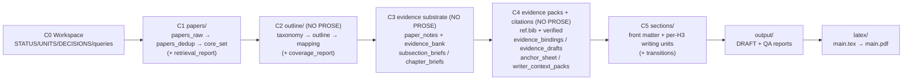

# research-units-pipeline-skills

> **一句话**：让 Pipeline 会"带人 / 带模型"做研究——不是给一堆脚本，而是给一套**语义化的 skills**，每个 skill 知道"该做什么、怎么做、做到什么程度、不能做什么"。

---

## WIP
1. 在 Appendix 增加了表格
2. 持续打磨写作技巧，提升写作上下限（已经尝试了增加 role playing 的 soft 约束）
3. 去除模板话描述
## Todo
1. 加入多 cli 协作，multi-agent design （在合适的环节接入 API，替代或者分担 codex 执行过程中的压力）
2. 完善剩余的Pipeline，example 新增例子
3. 精简Pipeline中冗余的中间内容，遵循优雅的奥卡姆剃刀原则，如无必要，勿增实体。


## 核心思路：把写 Survey 拆成“可恢复的小步”

传统做 research / 写 survey 的流水线常见两种极端：
- 只有脚本：能跑，但过程黑盒，失败了不知道改哪里。
- 只有文档：看起来都对，执行时还是靠人肉判断，容易漂移。

这套 repo 的做法很简单：把整条链路拆成**一串能验收、能恢复的小步**，每一步都落盘中间产物。

1) **Skill = 可执行的说明书（带验收）**
- 每个 skill 都写清楚：需要什么输入、必须产出哪些文件、什么算完成、哪些行为禁止（例如 C2–C4 禁止写正文）。
- 你不用记“该做到什么程度”：照着验收标准做，做不到就会被质量门拦住并写报告。

2) **Unit = 可恢复的小任务**
- 一次运行被拆成 C0→C5 六个 checkpoint，每一步是 `UNITS.csv` 里的一行。
- 失败时不需要全部重跑：修对那一个中间产物，然后从卡住的 unit 继续。

3) **先证据、后写作（防空洞/防模板）**
- C1 找论文 → C2 定结构（outline+每小节论文池）→ C3/C4 把证据整理成“可写材料” → C5 才写正文并出 PDF。

一眼看懂：你遇到的问题 vs 这里怎么解决

| 你遇到的问题 | 这里的机制 | 你会去看/去改哪里 |
|---|---|---|
| 流程黑盒：失败了不知道改哪里 | unit 合同 + 质量门报告（FAIL 指向具体中间产物） | `UNITS.csv` / `output/*REPORT*.md` / `output/*TODO*.md` |
| 文档松散：执行靠经验 | skill 语义化（inputs/outputs/acceptance/guardrail） | `.codex/skills/*/SKILL.md` |
| 写作空洞/模板话 | evidence-first（C2–C4）+ 写作自循环（C5） | `outline/*` / `sections/*` / `output/WRITER_SELFLOOP_TODO.md` |
| 想换交付但不想重写流程 | pipeline 只负责编排，能力沉淀在 skills | `pipelines/*.pipeline.md` |


English version: [`README.en.md`](README.en.md).


## codex 参考配置
配置可能会根据 codex 的更新有变化
```toml

[sandbox_workspace_write]
network_access = true

[features]
shell_snapshot = true
```


## 一句话启用（推荐：对话式跑一篇 survey）

1) 在本仓库目录启动 Codex：

```bash
codex --sandbox workspace-write --ask-for-approval never
```

2) 在对话里说一句你要什么（例子）：

> 给我写一篇关于 LLM agents 的 LaTeX survey

它会自动：新建一个 `workspaces/<时间戳>/` → 找论文 → 生成大纲 → **停在 C2（大纲确认）** 等你确认 → 再写草稿并编译 PDF。

可选：你也可以直接指定“用哪条流程”（需要 PDF 就选 LaTeX 版本）：

> 用 `pipelines/arxiv-survey-latex.pipeline.md` 给我写一个 agent 的 survey（启用 strict；先停在 C2 等我确认）

如果你想“不要停在 C2”，可以在开头明确说：`C2 自动同意`（适合你已经很熟悉这条链路的情况）。

术语解释（只保留你会遇到的几个）：
- workspace：一次运行的输出目录（在 `workspaces/<name>/`）
- skill：一个步骤的“可执行说明书”（写清输入/输出/验收/禁区）
- unit：一次运行里的一个小任务（`UNITS.csv` 一行）
- C2：大纲确认点；**没确认就不会写正文**
- strict：开启严格质量门；失败会停下来并写报告（在 `output/`）

## 你会得到什么（分层产物 + 自循环入口）

一个 workspace 里主要是两类东西：**运行清单** + **分阶段产物**。

默认配置（A150++，对齐“成熟 survey”交付）：
- 核心论文：`core_size=300`（对应 `papers/core_set.csv` / `citations/ref.bib`）
- 每个 H3 的可选论文池：`per_subsection=28`（对应 `outline/mapping.tsv`）
- 全局 unique citations：硬门槛 `>=150`，推荐目标 `>=165`（由 `draft_profile` + `citation_target` 控制）

**运行清单（看进度/看卡点）**：
- `UNITS.csv`：一行一个步骤（依赖/输入/输出/验收），卡住就看当前哪个 unit 是 `BLOCKED`
- `DECISIONS.md`：需要你确认的点（最重要的是 **C2：确认大纲后才写正文**）
- `STATUS.md`：运行日志（当前跑到哪一步）

**分阶段产物（你真正关心的内容）**：
```
C1（找论文）:
  papers/papers_raw.jsonl → papers/papers_dedup.jsonl → papers/core_set.csv
  + papers/retrieval_report.md   # 这次检索/筛选的说明

C2（搭骨架；不写正文）:
  outline/outline.yml + outline/mapping.tsv
  (+ outline/taxonomy.yml / outline/coverage_report.md)  # 可选：更结构化/更可审计

C3（做“可写”的证据底座；不写正文）:
  papers/paper_notes.jsonl + papers/evidence_bank.jsonl → outline/subsection_briefs.jsonl
  + papers/fulltext_index.jsonl  # 永远存在；abstract 模式只记录 skip，fulltext 模式才会下载/抽取

C4（把每小节写作包准备好；不写正文）:
  citations/ref.bib + citations/verified.jsonl
  + outline/evidence_bindings.jsonl / outline/evidence_drafts.jsonl / outline/anchor_sheet.jsonl
  → outline/writer_context_packs.jsonl
  + outline/tables_appendix.md  # 面向读者的 Appendix 表格（索引表只作为中间产物保留）

C5（写作与输出）:
  sections/*.md → output/DRAFT.md
  (+ latex/main.pdf)  # 只有 LaTeX pipeline 才会有
```

**质量门 + 自循环入口（失败先看这里，按报告定点修）**：
- 跑不动/脚本报错：`output/RUN_ERRORS.md`
- 开了 strict 且被拦住：`output/QUALITY_GATE.md`（最后一条就是当前卡住原因 + 下一步）
- 写作质量（只修列出的文件）：`output/WRITER_SELFLOOP_TODO.md`
- 段落“跳步/孤岛”：`output/SECTION_LOGIC_REPORT.md`
- 论证链路 + 口径一致性：`output/ARGUMENT_SELFLOOP_TODO.md`（口径单一真源在 `output/ARGUMENT_SKELETON.md# Consistency Contract`）
- 引用密度不够：`output/CITATION_BUDGET_REPORT.md`
- 全局体检：`output/AUDIT_REPORT.md`（最终审计）

## 简单的对话式执行（从 0 到 PDF）

```
你：写一篇关于 LLM agents 的 LaTeX survey

↓ [C0-C1] 找论文：检索候选（默认最多 1800）→ 去重 → 得到 core set（默认 300 篇：`papers/core_set.csv`）
↓ [C2] 生成“大纲 + 每小节论文池”（不写正文）：`outline/outline.yml` + `outline/mapping.tsv`（默认每个 H3 映射 28 篇）
   → 停在 C2 等你确认 （自动触发的行为，也可以在开头说默认跳过）

你：看过没问题，回复「同意继续」

↓ [C3-C4] 把论文整理成“可写材料”（不写正文）：
   - `papers/paper_notes.jsonl`：每篇论文的要点/结果/局限
   - `citations/ref.bib`：参考文献表（可引用的 key 集合）
   - `outline/writer_context_packs.jsonl`：每个小节的写作包（允许引用哪些论文 + 该写哪些对比点）
↓ [C5] 写作与输出：
   - 先写分小节文件：`sections/*.md`
   - 再合并成草稿：`output/DRAFT.md`
   - LaTeX pipeline 会额外生成：`latex/main.pdf`
   - 目标：全局 unique citations 推荐 `>=165`（不足会触发“引用预算/注入”步骤补齐）

【如果卡住】按报告定点修：
- 开了 strict：看 `output/QUALITY_GATE.md`（最后一条就是当前原因 + 下一步）
- 最终总审计：看 `output/AUDIT_REPORT.md`

你：按报告修复对应文件后说「继续」
→ 从卡住的那一步继续跑，不需要全部重跑
```

**关键原则**：C2-C4 强制 NO PROSE，先建证据底座；C5 才写作，失败时可定点修复中间产物。

## 示例产物（v0.1，包含完整中间产物）
这是一个“完整跑通”的示例 workspace：从找论文 → 出大纲 → 整理证据 → 写草稿 → 编译 PDF，所有中间产物都在里面，方便你对照理解整条链路。

- 示例路径：`example/e2e-agent-survey-latex-verify-<时间戳>/`（对应流程：`pipelines/arxiv-survey-latex.pipeline.md`）
- 过程中会在 **C2（大纲）** 停下来等你确认；确认后才会写正文
- 默认配置（A150++）：核心论文 300 篇、每个小节映射 28 篇、证据模式用 abstract（摘要级）；目标是全局引用足够密（全局 unique citations 默认收敛到推荐值）
- 一般建议：`draft_profile: survey`（默认交付）；想更严格再用 `draft_profile: deep`

目录速览（每个文件夹干嘛用）：

```text
example/e2e-agent-survey-latex-verify-<最新时间戳>/
  STATUS.md            # 进度与执行日志（当前 checkpoint）
  UNITS.csv            # 执行合约：一行一个 unit（依赖/验收/产物）
  DECISIONS.md         # 人类检查点（Approve C*）
  CHECKPOINTS.md       # checkpoint 规则
  PIPELINE.lock.md     # 选中的 pipeline（单一真相源）
  GOAL.md              # 目标/范围 seed
  queries.md            # 检索与写作档位配置（draft_profile/evidence_mode/core_size...）
  papers/              # C1/C3：检索结果与论文“底座”
  outline/             # C2/C3/C4：taxonomy/outline/mapping + briefs + evidence packs + tables/figures 规格
  citations/           # C4：BibTeX 与 verification 记录
  sections/            # C5：按 H2/H3 拆分的可 QA 小文件（含 chapter lead）
  output/              # C5：合并后的 DRAFT + 报告（audit/merge/citation budget...）
  latex/               # C5：LaTeX scaffold + 编译产物（main.pdf）
```

文件夹之间的“流水线关系”：



最终交付只看“最新一次跑通”的示例目录（按时间戳命名）。有改进就更新最新目录，历史版本一般保留 2–3 个用于对比回归。

你最常打开的三个文件：
- 草稿（Markdown）：`example/e2e-agent-survey-latex-verify-<最新时间戳>/output/DRAFT.md`
- PDF：`example/e2e-agent-survey-latex-verify-<最新时间戳>/latex/main.pdf`
- 体检报告（QA/Audit）：`example/e2e-agent-survey-latex-verify-<最新时间戳>/output/AUDIT_REPORT.md`


## 欢迎提出各类 issue，一起改进写作流程

## Star History

[](https://star-history.com/#WILLOSCAR/research-units-pipeline-skills&Date)
